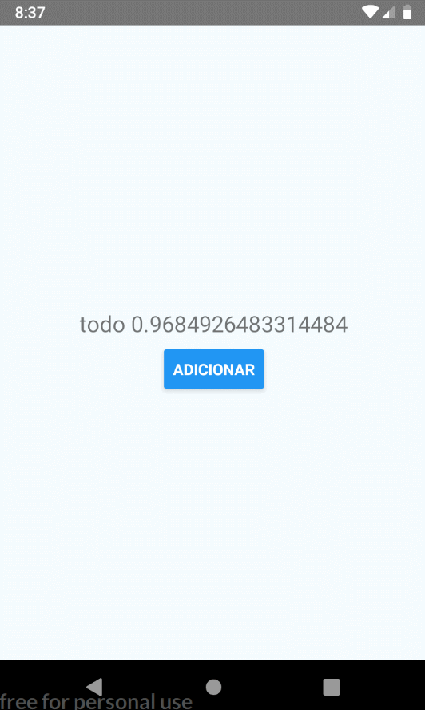

# React Native Examples
⭐️ exemplos de códigos desenvolvidos no react-native

#### Demonstração

Nota: o arquivo App.js se refere a um componente isolado, portando esse diretório só tem a finalidade de consulta.